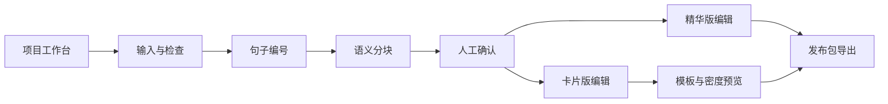

# 知页 · 小红书内容编译器

> 保留你的深度，重新组织表达。

知页服务的不是“没有内容的人”，而是已经参加活动、写下完整笔记，却迟迟没有把内容发布出去的知识型创作者。

它不是一个把长文“一键改写成小红书”的自动写作工具，而是一套可检查、可编辑、可回退的内容编译工作流：先把原文转换成带来源标识的结构化中间层，再从同一份中间层生成精华正文和 3:4 知识卡片，最后导出可以继续编辑或直接使用的发布资产。

本说明以当前目录的最新代码逻辑为事实基线，并吸收 `../PPT` 中的产品定位与功能表达。PPT 中尚未落地或与代码不一致的能力，会明确标记为实现边界或后续规划。

## 为什么是“内容编译器”

普通 AI 改写通常把原文直接交给模型，让模型自由生成结果。这个过程虽然快，却容易出现三个问题：

- 原始观点被压缩或改写，个人表达逐渐消失；
- 用户看不到生成结论来自哪段原文；
- 内容生成与视觉排版耦合，改文字往往意味着重新生成整套结果。

知页采用类似编译器的三层设计：

```text
原始长文
   ↓
结构化中间层：句子 ID、语义块、来源关系、分页计划
   ↓
发布资产：精华正文、卡片图片、结构化数据、原文备份
```

这种设计把“理解内容”“组织表达”和“视觉呈现”拆开，让用户能够在每个关键阶段检查结果，而不是只能接受一次性生成的黑盒答案。

## 功能设计原则

### 1. 原文是唯一事实源

系统先把原文按自然段和句子切分，为每个句子建立类似 `S02-03` 的唯一 ID。模型负责决定句子属于哪个语义块、应该放在哪一页，以及生成什么小标题；卡片正文则根据句子 ID 从原文重新拼装。

模型不会直接提供最终正文，因此即使模型的语义规划有误，也不会悄悄改写用户的原始句子。

### 2. AI 负责组织，不负责取代作者

模型主要承担：

- 识别语义块；
- 规划卡片顺序；
- 生成 6～14 字的小标题；
- 提供可选的短导语或结束语；
- 判断语义连续的句子是否需要拆成多页。

模型不负责：

- 自由改写卡片正文；
- 删除无法归类的原文；
- 用外部事实替代用户表达；
- 自动代表用户完成发布。

### 3. 中间结果必须可编辑

解析完成后，用户不是直接进入导出，而是先看到一组结构化观点。观点标题和摘要可以人工修改，卡片标题、正文、列表项和页面标识也可以逐页调整。

产品把人的角色放在“确认与修正”上，而不是要求用户重新从空白页面写一遍。

### 4. 内容与视觉相互解耦

同一组卡片内容可以切换不同模板和排版密度。修改文字后预览实时更新；切换模板不会重新调用模型，也不会改变原文结构。

这使内容可以长期复用，视觉风格则可以根据发布场景持续调整。

### 5. 模型不可用时仍能完成闭环

如果没有配置模型密钥，或模型请求、JSON 解析失败，系统会自动进入本地回退模式：

- 按自然段形成语义块；
- 以约 240 字为分页预算；
- 自动补充封面；
- 保留全部原文；
- 继续支持编辑、预览和 ZIP 导出。

AI 提升的是语义组织质量，而不是整个产品能否运行的前提。

## 完整工作流



当前界面分为一个项目工作台和四个内容阶段：

1. 内容输入
2. 结构化解析
3. 内容编辑器
4. 导出与记录

## 核心功能

### 项目工作台

每个项目拥有独立的：

- 活动信息；
- 原始长文；
- 结构化观点；
- 卡片内容；
- 当前模板；
- 排版密度；
- 编辑模式。

支持新建、切换和删除项目。项目数据以 700 毫秒防抖方式自动写入浏览器 `localStorage`，用户在同一浏览器刷新页面后可以继续编辑。

当前项目数据不会自动同步到其他设备，也没有接入账户级云端存储。

### 输入与即时检查

输入阶段包含：

- 项目名称；
- 活动名称；
- 活动类型；
- 输出模式；
- 原始长文。

活动类型目前提供：

- Roundtable Discussion
- Conference
- Coffee Chat
- Workshop
- Community Share

系统实时计算：

- 当前字符数；
- 自然段数量；
- 预计卡片数量；
- 是否超过 10,000 字符限制。

“输入检查”会验证项目名称、活动名称和原始长文是否有效。检查过程不会调用模型。

活动类型当前主要作为项目元数据使用，尚未针对大会、圆桌、工作坊等场景采用不同的解析策略。

### 结构化语义解析

服务端解析分为四步：

1. 按空行切分自然段；
2. 按中文标点切分句子并生成唯一 ID；
3. 调用 OpenAI Chat Completions 兼容接口生成语义块和卡片计划；
4. 校验模型结果，并根据句子 ID重组正文。

归一化阶段还会执行：

- 移除不存在的句子 ID；
- 防止同一句原文被重复使用；
- 对模型遗漏的句子执行本地回退；
- 检查小标题是否直接复制正文开头；
- 限制标题长度；
- 保证封面位于卡片组首位。

解析结果以“核心观点”形式呈现，用户可以修改观点标题和摘要，并查看来源入口。

当前模型结果记录的是句子 ID，而证据面板仍主要按段落 ID 查找，真实模型解析后的来源展示存在映射不完整的问题；这部分需要继续修正。

### 两种内容形态

#### 精华版

精华版提供：

- 标题编辑；
- 正文编辑；
- 话题标签编辑；
- 字符数统计；
- 一键复制标题、正文和标签。

当前服务端默认把原文按句子顺序重新拼接为正文，并给出通用标签。它已经形成完整的编辑与复制界面，但尚未实现 PPT 中描述的自动精简、局部重写和稳定的 980 字符压缩策略。

#### 完整卡片版

卡片版以逐页方式编辑：

- 页面标识；
- AI 小标题；
- 原文正文；
- 可选列表项；
- 可选导语和结束语；
- 当前页与总页数。

模型目标是让每张内容卡保持约 120～280 个中文字符，并尽量不拆散语义连续的句子。本地回退采用约 240 字的分页预算。

输入页显示的预计卡片数被限制在 3～12 张，但实际生成页数由模型规划或本地分段结果决定，并没有强制锁定为 PPT 中表述的 5～12 页。

### 模板与排版密度

当前实现四套卡片模板：

| 模板 | 设计倾向 |
| --- | --- |
| Research Light | 清晰、理性、适合专业复盘 |
| AI Dark | 技术感、高对比 |
| Warm Reflection | 温暖、叙事化 |
| Structured Notes | 冷灰、墨绿、结构化 |

每套模板都可以使用三档密度：

- 舒展
- 标准
- 紧凑

模板和密度只改变视觉呈现，不会重新生成内容。这是“同一内容，多种表达形态”的核心实现。

### 实时 3:4 预览

编辑器按照 3:4 比例预览卡片，并显示连续页码。用户可以：

- 在不同页面之间切换；
- 实时查看文字修改；
- 实时切换模板；
- 实时调整排版密度；
- 查看 AI 导语、原文和结束语的层级关系。

界面会展示“无文字溢出、标题未孤立、末页平衡良好、页码连续”等状态，但目前这些状态主要是固定提示，尚未全部对应真实的布局测量和阻断逻辑。

### 浏览器端高清导出

导出不依赖服务端图片任务，而是在浏览器中完成：

1. 创建隐藏的 React 卡片节点；
2. 使用 `html-to-image` 转换为 PNG；
3. 将预览尺寸映射为 1080 × 1440；
4. 使用 `JSZip` 生成发布包；
5. 直接下载到当前设备。

ZIP 文件结构：

```text
manifest.json
title.txt
content.txt
tags.txt
cards/
  card-01.png
  card-02.png
  ...
source/
  original.txt
  structured-content.json
```

发布包不仅包含最终图片，也保留标题、正文、标签、原文和结构化观点，方便用户继续修改、审查或迁移到其他工作流。

## 产品适用场景

### Conference

从信息密集的大会笔记中提取主线，把展区观察、主题演讲和个人判断组织成连续内容。

### Roundtable

面对多人观点交错的笔记，按语义重新分组，减少内容跳跃。

### Workshop

把过程、方法和行动项整理成更适合逐页阅读的步骤内容。

### Coffee Chat

保留个人化叙事，把零散交流整理成观点和反思。

当前代码对这些场景使用同一套通用语义拆分逻辑，场景化策略属于后续增强方向。

## 功能实现状态

| 功能 | 当前状态 |
| --- | --- |
| 多项目创建、切换、删除 | 已实现 |
| 项目自动保存 | 已实现，使用浏览器 `localStorage` |
| 10,000 字符限制与输入检查 | 已实现 |
| 段落、句子 ID 与语义块 | 已实现 |
| OpenAI 兼容模型调用 | 已实现 |
| 无模型本地回退 | 已实现 |
| 原文句子去重与缺失补回 | 已实现 |
| 结构化观点人工编辑 | 已实现 |
| 来源证据面板 | 已有界面，句子/段落映射待修复 |
| 精华版编辑与复制 | 已实现 |
| 自动精简与局部重写 | 尚未实现 |
| 卡片逐页编辑 | 已实现 |
| 添加 Block、删除卡片 | 按钮已存在，行为尚未接入 |
| 四套模板与三档密度 | 已实现 |
| 真实文字溢出和分页检测 | 尚未完整实现 |
| 1080 × 1440 PNG | 已实现 |
| ZIP 发布包 | 已实现 |
| 版本保存与恢复 | 当前会话内可用，刷新后不保证保留 |
| 导出记录 | 当前会话内记录 |
| 发布前隐私复核 | 最新代码未实现 |
| 登录、云端项目和跨设备同步 | 后端结构已预置，主流程尚未接入 |
| 自动发布、视频生成 | 规划能力，尚未实现 |

## 数据设计

### 当前实际存储

项目工作区保存在：

```text
localStorage["xhs-compiler-workspaces"]
```

保存内容包括项目输入、观点、卡片、模板、密度和编辑模式。

内容版本和导出记录目前主要保存在 React 页面状态中，不属于可靠的长期历史。

### 已预置但尚未接入的后端

Nubase 迁移已经创建：

- `content_projects`
- `content_versions`
- `export_packages`
- 私有存储桶 `content-compiler-exports`
- 基于 `auth.uid()` 的行级访问策略

主业务页面尚未读写这些表，不能把当前版本理解为已经完成云端持久化。

## 模型配置

语义解析使用 OpenAI Chat Completions 兼容接口：

| 环境变量 | 说明 |
| --- | --- |
| `MODEL_KEY` | 首选模型密钥 |
| `OPENAI_API_KEY` | `MODEL_KEY` 的兼容替代项 |
| `MODEL_BASE_URL` | 接口地址，默认 `https://api.openai.com/v1` |
| `MODEL_NAME` | 模型名称，默认 `gpt-4.1-mini` |

模型密钥必须放在服务端或 Cloudflare Worker 运行环境中，不得写入客户端代码。

启用模型时，原文、项目名称和活动名称会发送到所配置的模型服务。部署方需要根据模型供应商的数据政策补充隐私说明。

## 技术架构

- React 19
- TypeScript
- TanStack Router
- TanStack Start Server Function
- Vite 8
- Tailwind CSS 4
- Cloudflare Workers
- `html-to-image`
- `JSZip`
- Nubase / Supabase 兼容基础设施
- Bun

主要实现位于：

```text
src/routes/index.tsx
src/semantic-cards.server.ts
src/server.ts
src/styles.css
```

## 本地运行

在当前目录运行：

```bash
bun install
bun run dev
```

默认访问：

```text
http://localhost:3000
```

没有配置模型密钥时，可以直接体验本地回退流程。

## 构建、测试与部署

```bash
# 生产构建
bun run build

# 运行测试
bun run test

# 构建并部署到 Cloudflare Workers
bun run deploy
```

当前 Vitest 配置允许没有测试文件时通过，核心内容编译逻辑仍需要补充自动化测试。

## 下一阶段功能方向

以下内容来自产品路线图，不代表当前代码已经实现。

### 个性化模板

- 品牌色和字体；
- 署名、水印和固定版式；
- 封面、正文、总结页的独立模板；
- 个人或团队模板保存。

### 内容驱动的封面与配图

- 根据结构化观点生成封面；
- 生成概念配图；
- 对现场图片进行裁剪、调色和拼贴；
- 保持封面、配图和卡片的视觉统一。

### 发布流程

- 使用用户本地浏览器完成发布；
- 发布前保留人工确认；
- 支持队列、定时和失败恢复；
- 不上传账号 Cookie；
- 不绕过平台规则。

### 视频内容

- 从结构化观点生成分镜；
- 生成口播脚本和字幕；
- 组合卡片、配图、转场和配音；
- 复用现有内容中间层生成短视频。

## 产品目标

当前阶段最重要的不是继续堆叠功能，而是验证这套内容编译方法是否真正帮助创作者完成发布：

- 是否能快速得到可编辑的首版；
- 是否显著减少人工整理时间；
- 是否能够完整走到导出；
- 用户是否认可“保留原意”；
- 生成的卡片是否真的被发布、收藏和分享。

知页希望完成的不是更多自动生成，而是让每一次参与，都变成一次被看见的专业表达。
